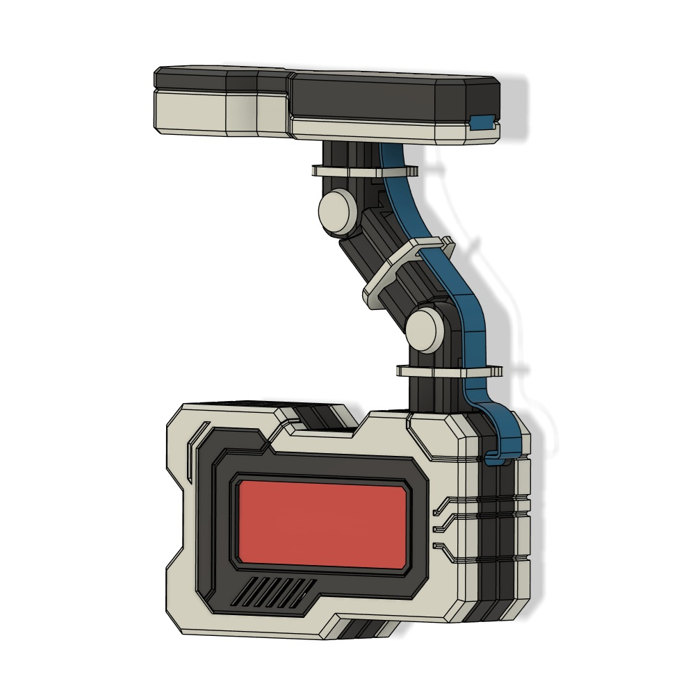
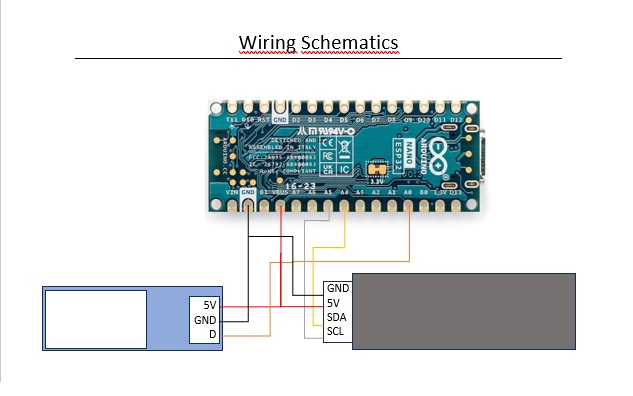

This is the technical part of my weather station, which I’m sharing on [Printables](https://www.printables.com/@Staldy/models)).

To get started with this project, you should be familiar with the Arduino Cloud. Please follow the [official guide](https://docs.arduino.cc/arduino-cloud/guides/overview/) to:

- Create a new “Thing”
- Associate your Nano ESP32 device
- Connect to your Wi-Fi network
- Create the five required variables (see [variables.md](https://github.com/staldy/weather_station/blob/main/variables.md) for details)
- Download the main code: [Station_v2.ino](https://github.com/staldy/weather_station/blob/main/Station_V2.ino) 

You will also find a wiring diagram ([wiring_schematics.jpg](https://github.com/staldy/weather_station/blob/main/wiring_schematics.jpg)).

