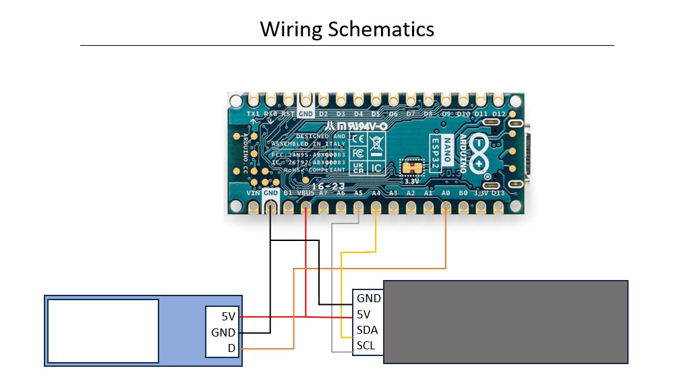

## Project

This is the technical part of my weather station, which I’m sharing on [Printables](https://www.printables.com/model/1328478-weather-station-with-7-segment-display).

<table>
  <tr>
    <td></td>
    <td></td>
  </tr>
</table>

## Assembly Video

Watch the full [assembly Video](https://www.youtube.com/watch?v=YpZZJhHqThI) showing the build process step by step.

## Code Instructions

To get started with this project, you should be familiar with the Arduino Cloud. Please follow the [official guide](https://docs.arduino.cc/arduino-cloud/guides/overview/) to:

- Create a new “Thing”
- Associate your Nano ESP32 device
- Connect to your Wi-Fi network
- Create the five required variables (see [variables.md](https://github.com/staldy/weather_station/blob/main/variables.md) for details)
- Upload the main code: [station.ino](https://github.com/staldy/weather_station/blob/main/station.ino)

## Wiring Schematics

You will also find a wiring diagram here:  
[**wiring_schematics.jpg**](https://github.com/staldy/weather_station/blob/main/wiring_schematics.jpg)

